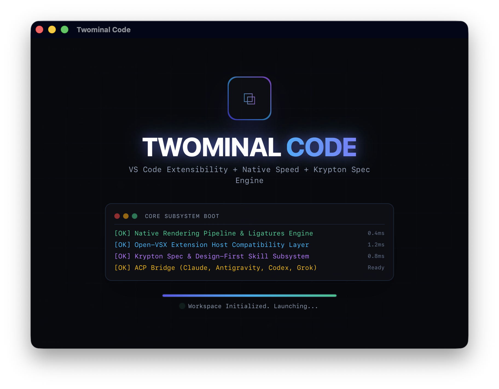
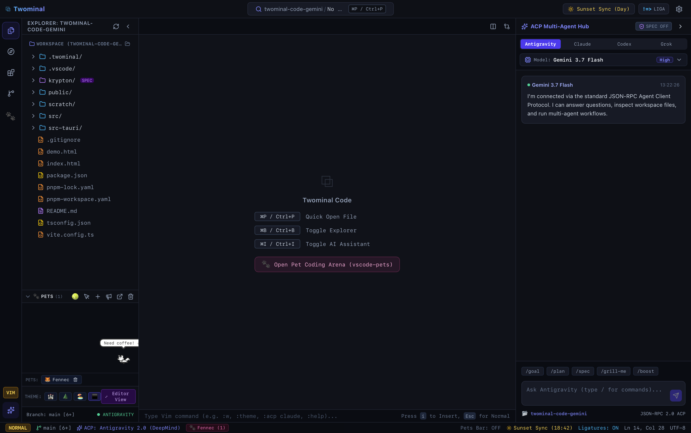

# Twominal Code

A desktop application powered by Rust and Tauri V2.

<p align="center">
  
  <br/><br/>
  
</p>

## Development

Install dependencies:
```bash
pnpm install
```

Start the development server:
```bash
pnpm tauri dev
```

Build for production:
```bash
pnpm tauri build
```

---

## 📄 License

This project is licensed under the [MIT License](LICENSE).
